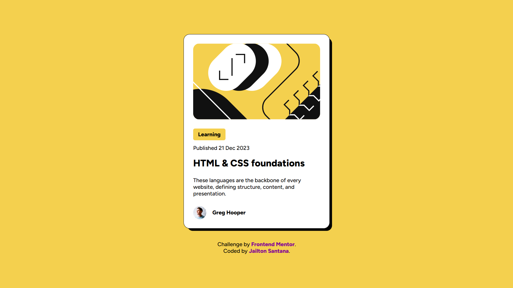

# Blog Preview Card

Este é um projeto de cartão de visualização de blog, criado como um desafio do [Frontend Mentor](https://www.frontendmentor.io). Ele apresenta um layout responsivo e estiloso, projetado para exibir informações de um blog de forma visualmente atraente.

## 📷 Prévia


## Tecnologias Utilizadas

- **HTML5**
- **CSS3** (Flexbox, Media Queries)
- **Google Fonts** ([Figtree](https://fonts.google.com/specimen/Figtree))

## Funcionalidades

- Design responsivo que se adapta a diferentes tamanhos de tela (desktop e dispositivos móveis);
- Layout minimalista com um esquema de cores harmonioso;
- Uso de sombreamento e bordas arredondadas para criar um efeito moderno e limpo.

## Estrutura do Projeto

A estrutura do projeto é simples e bem organizada:

```
.
├── index.html       # Estrutura HTML do cartão
├── css
│   └── style.css    # Estilos CSS
├── assets
│   ├── images       # Imagens usadas no projeto
│   └── favicon.ico  # Ícone do projeto
└── README.md        # Documentação do projeto
```

## Como Executar o Projeto

1. Clone este repositório para sua máquina local:
   ```bash
   git clone https://github.com/Jotta-Sant/blog-preview-card.git
   ```

2. Navegue até a pasta do projeto:
   ```bash
   cd blog-preview-card
   ```

3. Abra o arquivo `index.html` em seu navegador favorito.

## Desafios Encontrados

- Garantir que o design seja responsivo para diferentes resoluções de tela;
- Ajustar o espaçamento interno e externo para manter o layout visualmente equilibrado.

## Autor

Desenvolvido por [Jailton Santana](https://github.com/Jotta-Sant). Sinta-se à vontade para explorar e sugerir melhorias!

## Créditos

Este projeto foi inspirado no desafio "Blog Preview Card" do [Frontend Mentor](https://www.frontendmentor.io), com design fornecido pela plataforma.

---

### Licença

Este projeto é de uso livre para estudos e aprimoramento pessoal. Caso utilize o design ou código, por favor, mantenha os créditos.

